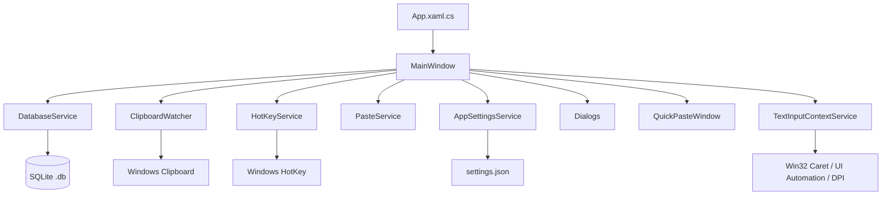

# 架构与代码结构

## 总体架构

PromptPaste 是单进程 WPF 桌面应用，主窗口负责 UI 编排和用户交互，服务类封装系统能力，数据库服务封装 SQLite 读写。

## 入口与生命周期

- `App.xaml.cs`
  - 创建 `MainWindow`。
  - 初始化托盘图标和托盘菜单。
  - 处理关闭到托盘或真实退出。
  - 注册全局异常日志。
- `MainWindow.xaml` / `MainWindow.xaml.cs`
  - 主界面、菜单、顶栏搜索、左侧导航、卡片列表。
  - 负责将用户动作转换为数据库和服务调用。
  - 维护筛选状态：搜索文本、当前分类、回收站视图、标签筛选。

## 主要服务

| 服务 | 职责 |
|------|------|
| `DatabaseService` | SQLite 表创建、迁移、CRUD、分类、标签、回收站、导入导出 |
| `AppSettingsService` | 读写 `%USERPROFILE%\.promptpaste\settings.json`，维护最近数据库 |
| `ClipboardWatcher` | 监听 Windows 剪贴板变化，并按实际文本过滤软件内部复制、变量替换复制和剪贴板恢复事件 |
| `HotKeyService` | 注册/注销全局热键，解析热键字符串 |
| `LowLevelHotKeyService` | 在 `RegisterHotKey` 失败时作为快速候选热键兜底，使用低层键盘钩子监听组合键 |
| `QuickPasteSearchService` | 为快速候选弹窗按标题、内容和标签检索候选片段 |
| `TextInputContextService` | 获取当前外部文本输入上下文，综合 Win32 caret、UI Automation、鼠标兜底和混合 DPI 坐标转换 |
| `PasteService` | 将文本写入剪贴板并向目标窗口发送 Ctrl+V，同时标记内部复制文本 |
| `VirtualDesktopService` | 热键唤出时尝试将窗口移动到当前虚拟桌面 |
| `IconHelper` | 从资源图标创建窗口和托盘图标 |
| `TextProcessor` | 提取 `{{变量}}`，执行变量替换和文本截断 |
| `BackupService` | 危险操作或迁移前复制当前数据库到备份目录 |
| `LogService` | 写入本地日志，避免异常导致应用崩溃 |

## 主要模型

| 模型 | 用途 |
|------|------|
| `ClipboardItem` | 片段运行时模型，含分类 ID、分类路径、标签和删除时间 |
| `CategoryNode` | 分类树节点，含父级、路径、数量和子节点集合 |
| `TagInfo` | 标签信息 |
| `ExportClipboardItem` | JSON 导入导出模型 |
| `AppSettings` | 用户设置、最近数据库路径、主窗口热键和快速候选热键 |
| `TextInputContext` | 快速候选定位上下文，包含目标窗口句柄、弹窗锚点、定位来源和 DPI 缩放 |

## 对话框

| 对话框 | 用途 |
|--------|------|
| `ItemDialog` | 新建/编辑片段，选择多分类、输入标签和正文 |
| `VariableDialog` | 当模板含多个变量或顶栏变量为空时录入变量值 |
| `QuickPasteWindow` | 输入法式快速候选弹窗，支持搜索、键盘选择、悬停完整内容提示和插入 |
| `OptionsDialog` | 主窗口热键、快速候选热键、剪贴板、托盘行为和诊断设置 |
| `JsonFormatDialog` | 展示并复制 JSON 导入导出示例 |
| `LogViewerDialog` | 查看、刷新、复制最新应用日志，并打开日志目录 |

## 快速候选定位约定

- 快速候选热键优先通过 `RegisterHotKey` 注册；只有注册失败时才启用 `LowLevelHotKeyService` 兜底，避免同一次按键触发两次。
- `TextInputContextService` 的定位优先级：Win32 caret → UIA 文本选区 → UIA 焦点控件 → 鼠标位置。
- Win32/UIA 返回的物理屏幕坐标会按目标显示器 origin 和 DPI 缩放转换为 WPF DIP 坐标，兼容混合 DPI 多显示器。
- `QuickPasteWindowPlacement` 根据锚点、弹窗尺寸和虚拟屏幕边界计算最终位置，靠右/靠底时自动避让。

## UI 状态刷新约定

- `LoadData()`：重新读取分类树、标签集合，并重新应用筛选。
- `ApplyFilter()`：根据搜索、回收站、当前分类、标签筛选生成卡片列表。
- 分类变更后保留展开状态：通过捕获和恢复已展开分类 ID 实现。
- 删除、导入、清空回收站等危险操作前先备份数据库。

## 边界说明

- UI 事件目前集中在 `MainWindow.xaml.cs`，没有 MVVM 拆分。
- 数据库服务直接返回模型对象，未引入仓储接口或依赖注入。
- 文档中的行为以当前代码为准；旧 Python 文档仅供迁移参考。
