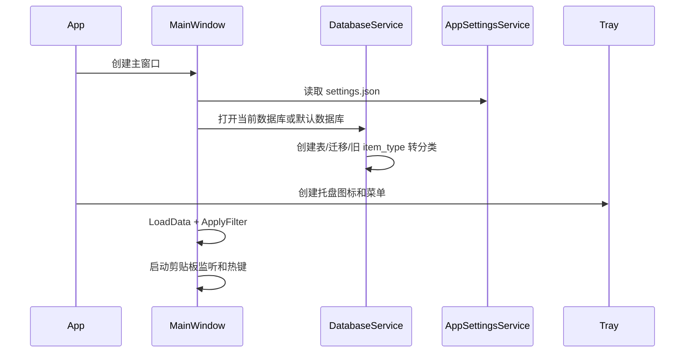

# 交互流程与测试验收

## 启动流程



## 复制/粘贴片段流程

1. 用户点击卡片“复制”或右键“仅复制”。
2. 如果内容没有 `{{变量}}`，直接复制。
3. 如果只有一个变量且顶栏变量框有值，用顶栏值替换。
4. 如果有多个变量或顶栏变量为空，打开变量输入对话框。
5. 写入剪贴板前标记为软件内部复制。
6. 数据库增加使用次数并更新最近使用时间。
7. UI 重新应用筛选并显示 Toast。

双击卡片会把处理后的文本粘贴到热键捕获的目标窗口；如果没有目标窗口，则回退到当前前台窗口。

## 剪贴板监听流程

1. `ClipboardWatcher` 监听 `WM_CLIPBOARDUPDATE`。
2. 如果剪贴板无文本或为空白，忽略。
3. 如果内容来自软件内部复制，忽略。
4. 外部新文本进入 `PendingClipboardText`。
5. 主界面顶部显示“检测到新的剪贴板内容”。
6. 用户可选择保存为片段或忽略。

## 分类拖拽流程

- 分类拖到其他分类上：移动为目标分类的子分类。
- 若目标下已有同名分类：提示确认后合并。
- 片段拖到分类上：把片段加入该分类，不移除原分类关系。
- 分类新增/删除后应保持原有展开状态。

## 回收站流程

- 普通删除：进入回收站。
- 从当前分类移除：只删除关系，不进入回收站。
- 恢复：清空 `deleted_at`。
- 永久删除：删除片段本体和关系。
- 清空回收站：物理删除所有已删除片段。

## 自动化验证命令

单元测试：

```bash
sln_win=$(wslpath -w PromptPaste.sln)
/mnt/c/Windows/System32/WindowsPowerShell/v1.0/powershell.exe -NoProfile -ExecutionPolicy Bypass -Command "dotnet test "$sln_win" -c Release"
```

当前自动化测试重点覆盖非 UI 逻辑；WPF 视觉和系统级交互仍以启动冒烟与手工验收为主。

构建验证:

```bash
rm -rf -- PromptPaste/obj PromptPaste/bin
project_win=$(wslpath -w PromptPaste/PromptPaste.csproj)
/mnt/c/Windows/System32/WindowsPowerShell/v1.0/powershell.exe -NoProfile -ExecutionPolicy Bypass -Command "dotnet build \"$project_win\" -c Release"
```

启动冒烟：

```bash
exe_win=$(wslpath -w PromptPaste/bin/Release/net8.0-windows/PromptPaste.exe)
/mnt/c/Windows/System32/WindowsPowerShell/v1.0/powershell.exe -NoProfile -ExecutionPolicy Bypass -Command '$p = Start-Process -FilePath "'"$exe_win"'" -PassThru; Start-Sleep -Seconds 3; if ($p.HasExited) { Write-Host "EXITED:$($p.ExitCode)" } else { Write-Host "RUNNING"; Stop-Process -Id $p.Id -Force }'
```

发布脚本验证：

```bash
script_win=$(wslpath -w build.ps1)
/mnt/c/Windows/System32/WindowsPowerShell/v1.0/powershell.exe -NoProfile -ExecutionPolicy Bypass -File "$script_win"
```

## 发布候选版验收顺序

1. 清理 `PromptPaste/bin`、`PromptPaste/obj`、`.build`。
2. 运行完整单元测试。
3. 运行发布脚本并检查根目录 `bin`。
4. 从 `bin/PromptPaste.exe` 做启动冒烟。
5. 按下方手工验收重点逐项操作。

## 手工验收重点

- 顶栏搜索框和变量框有灰色提示文字，输入后提示隐藏。
- 卡片复制、编辑、删除按钮都能触发后端操作。
- 卡片日期、标签 chip 和底部按钮位置稳定；无标签片段不显示空白标签占位。
- 编辑片段标签并保存后，卡片标签立即刷新。
- 新建分类弹窗打开后文本框自动聚焦。
- 分类树新增/删除后保持展开状态。
- 同名分类拖拽合并不崩溃。
- 剪贴板监听不会提示本软件内部复制出去的内容。
- 热键在 Windows 10/11 虚拟桌面中从当前桌面唤出窗口。
- 回收站恢复、永久删除、清空符合预期。
- 打开新数据库后可热切换，最近数据库菜单更新。
